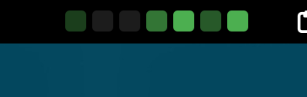

<h1>Weekly Commits (GNOME extension)</h1>
<h3>See your past weeks' GitHub contributions in the top bar</h3>




[](https://extensions.gnome.org/extension/8146/weekly-commits/)

## Features
- Displays the number of commits via seven boxes in the top bar.
- Popup menu displays the number of commits each day.
- GUI preferences menu to set GitHub credentials and other settings.
- Auto update the data based on configurable intervals.
- Set the position of the extension manually.

## Installation
1. Clone this repository:
   ```bash
   git clone https://github.com/funinkina/weekly-commits
   ```
2. Move this repository to the GNOME extensions directory:
   ```bash
   mv weekly-commits ~/.local/share/gnome-shell/extensions/
   ```
3. Restart GNOME Shell (press `Alt` + `F2`, type `r`, and press `Enter`) or log out and log back in of you are on Wayland.
   
4. Enable the extension from the GNOME Extenstions app or from the command line:
   ```bash
   gnome-extensions enable weekly-commits@funinkina.is-a.dev
   ```

## Configuration
To make the extension work, you need to set your GitHub `username` and a **Fine Grained Personal Access Token** (PAT) with Repository Acess to 'All repositories'. Get it from [here](https://github.com/settings/personal-access-tokens/new).

And put your GitHub username and the token in the extension's settings. 

## TODO
- [x] Add a settings page to configure the GitHub username and PAT.
- [x] Make it fetch the commits at some interval (e.g. every hour).
- [x] Let users configure the placement in the top bar.
- [x] Add a popup with the number of commits on the day.
- [ ] Add option for week start day (Monday or Sunday).
- [ ] Customisable commit view thresholds.
- [ ] Add translations.

## License
This project is licensed under the MIT License. See the [LICENSE](LICENSE) file for details.
